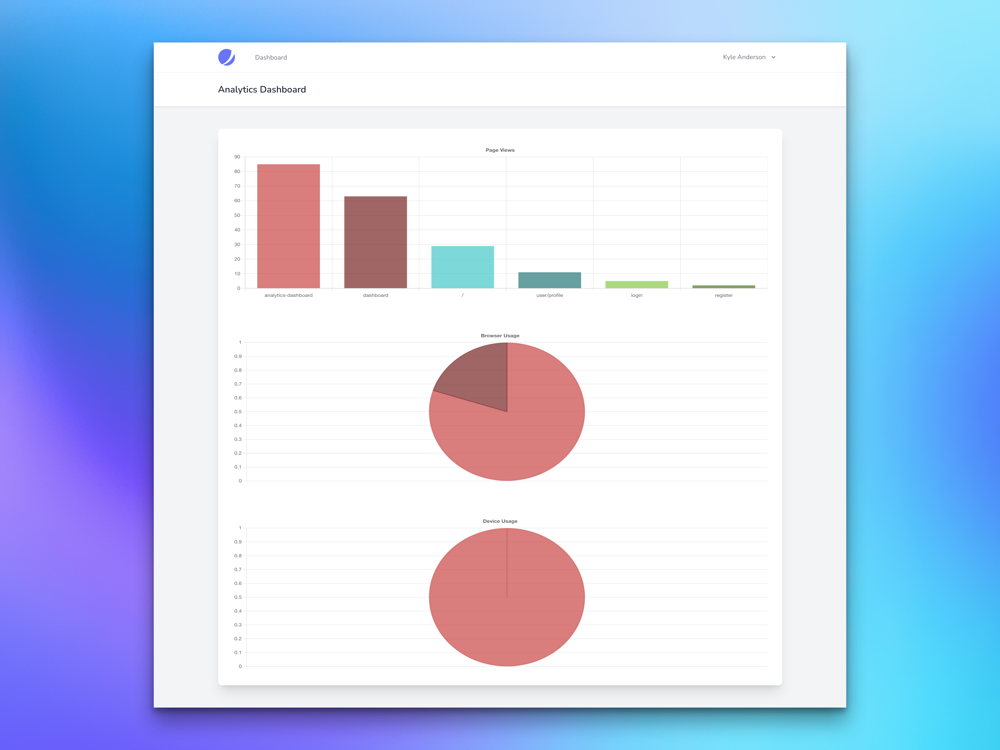

# Laravel Analytics

[](https://packagist.org/packages/lancodev/laravel-analytics)
[](https://github.com/lancodev/laravel-analytics/actions?query=workflow%3Arun-tests+branch%3Amain)
[](https://github.com/lancodev/laravel-analytics/actions?query=workflow%3A"Fix+PHP+code+style+issues"+branch%3Amain)
[](https://packagist.org/packages/lancodev/laravel-analytics)

This package provides a simple way to capture site analytics within your existing Laravel application.

## Installation

Install the package via composer:

```bash
composer require lancodev/laravel-analytics
```

Publish and run the migrations:

```bash
php artisan vendor:publish --tag="laravel-analytics-migrations"
php artisan migrate
```

Publish the components and views:

```bash
php artisan vendor:publish --tag="laravel-analytics-components"
php artisan vendor:publish --tag="laravel-analytics-views"
```

## Usage

### Trackable Trait

The package provides an optional `Trackable` trait that can be used to assign page view analytics to a model. The trait provides a `pageViews` relationship that can be used to retrieve the page views for the model.

This would typically be implemented by the `User` model. However, it could also be implemented by any other model that you wish to track page views for.

To use the trait, simply add the following to your model:

```php
namespace App\Models;

use Lancodev\LaravelAnalytics\Traits\Trackable;

class User
{
    use Trackable;
}
```

### Tracking

To begin tracking analytics, add the `<x-analytics-analytics />` component to your layout file(s).
This will add the necessary JavaScript to your application.

```html
<html>
    <head>
        <title>My Application</title>
    </head>
    <body>
        ``` content ```

        <x-analytics-analytics />
    </body>
</html>
```

### Analytics Dashboard

The package also provides a simple dashboard component that can be used to display analytics for your application.

The dashboard can be added to any view by adding the following:

```html
<x-analytics-dashboard />
```

This will add the following to your page:



## Testing

```bash
composer test
```

## Changelog

Please see [CHANGELOG](CHANGELOG.md) for more information on what has changed recently.

## Contributing

Please see [CONTRIBUTING](CONTRIBUTING.md) for details.

## Security Vulnerabilities

Please review [our security policy](../../security/policy) on how to report security vulnerabilities.

## Credits

- [Kyle Anderson](https://github.com/lancodev)
- [All Contributors](../../contributors)

## License

The MIT License (MIT). Please see [License File](LICENSE.md) for more information.
